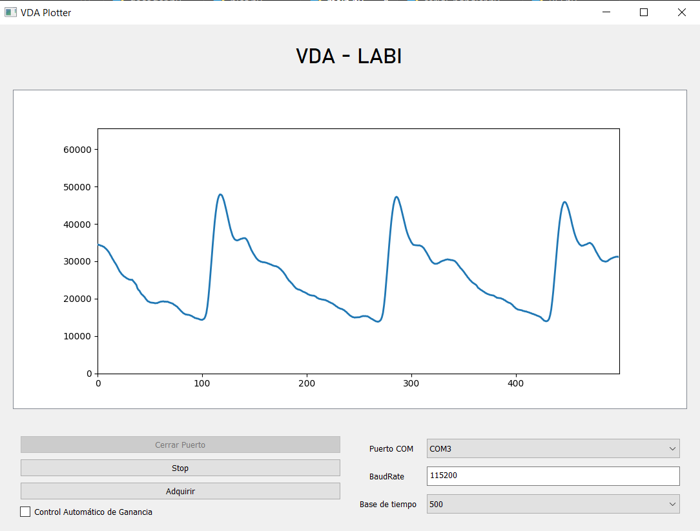

# VDA_Software

This repository contains the graphical user interface (GUI) developed in **Python** using **PyQt5** for the **VDA Signal Acquisition System**. The GUI allows users to configure the system, visualize signals in real time, and log data acquired from a piezoelectric sensor placed over the radial artery.

## 📢 Compatibility Notice

✅ The **`V9` branch** contains the version of the interface that is fully compatible with the most recent hardware developed for this project.  
🔁 Other branches correspond to earlier GUI versions used with previous prototypes and are not compatible with the current acquisition system.  
Be sure to switch to the `V9` branch before running the software with the latest hardware.

## 📷 GUI Preview

## 💡 Features

- Real-time plotting of digitized VDA signals
- Serial communication with STM32-based acquisition hardware
- COM port and baud rate selection
- Control panel for:
  - Starting/stopping live acquisition
  - Enabling/disabling Automatic Gain Control (AGC)
  - Logging data to `.txt` file
  - Adjusting time base for visualization
- State machine to manage control availability based on system state

## 🛡 License

This software is released under the MIT License.

📌 **Non-commercial use only**: While the code is freely available for academic and personal use, **commercial use is not permitted** without prior written authorization from the author.

## 📬 Contact

For questions, suggestions or collaboration, feel free to open an issue or contact me.

[leandrozabala@mdp.edu.ar](leandrozabala@mdp.edu.ar)
